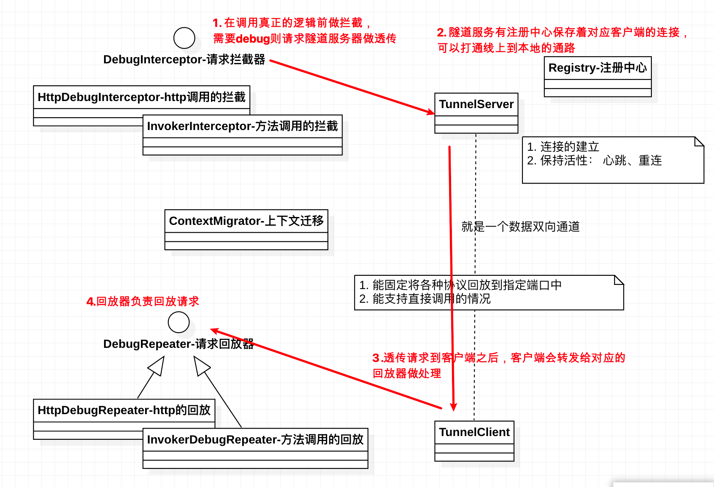

## 前言

Local Debug 为提升开发测试环境调试效率而生， 让调试变得更简单。
通过Local Debug, 开发者可以本地单独启动需要调试的服务，接受线上的回放请求去调试。

我们知道微服务模式下，本地因关联的服务过多，几乎很难本地起一整套环境去做开发和测试。 

这个时候还有另外一种解法是 java remote debug，不过有以下缺陷：
- 在测试前得将开发的代码发布到线上，如果大的调整还得重新发版，这样一来一回很浪费时间
- 调试速度慢，查看变量的时候需要等很久才能响应
- 多人调试会有影响。

Local Debug 可以解决这种问题， 以下是 Local Debug 的工作流程：

## 工作流程

1. 线上接受到请求，在处理真正的逻辑前做拦截，转发给 隧道服务(debugger-server)
2. 隧道服务(debugger-server) 查找注册表， 找到与线上匹配的对应本地服务
3. 将请求转发给本地的隧道服务客户端(debugger-client)
4. 本地重新回放整个请求
5. 本地处理请求过程中，能正常调用线上服务(这块这次先不处理，因为dice环境下本地是能调用线上的)

## 使用说明

TODO， 具体用法完善。

本地和远程服务需要配置 `spring.application.name` , 这样才能找到对应的服务路由到本地。

## 后续规划
- 支持dubbo， 新规划大家都用dubbo了，这个支持有必要。
- debuggerServer 也可以做代理转发一些线上请求，避免客户端需要依赖很多东西，比如数据库/uc/mq等。
- 简化接入方式，不用运行时对localdebug jar的强依赖， 或者可以agent的接入方式
